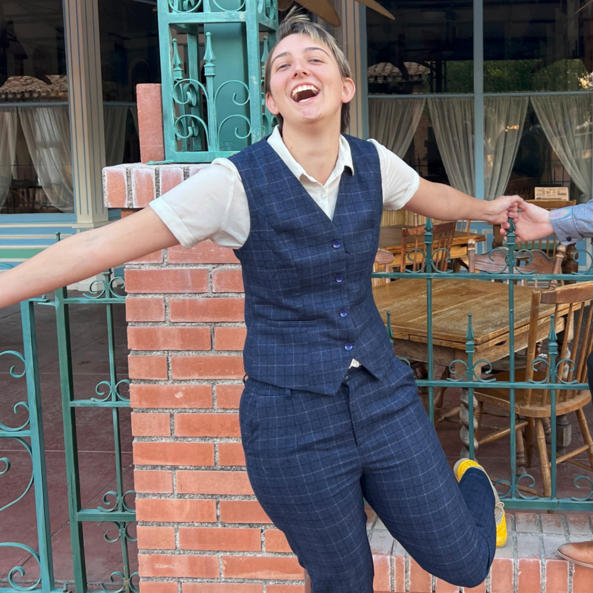

Ryn Gray graduated May 2024 with their PhD from the University of Arizona. They received their Bachelor of Sciences in Computer Science and Applied Mathematics from the University of Colorado at Boulder.  Their research interests include visualizations, especially visualizations of large graphs, graph algorithms, machine learning, data science, and knitting.  

In their free time, Ryn helps run the Lindy Hop scene in Tucson, takes care of their lizards, and knits fabulous items.

If you are interested in contacting them, please reach out to the following place:

Research, graph topics, visualization, machine learning: ryngray@arizona.edu

Dancing, switch dancing, lessons, performances: thejellyroles@gmail.com

Knitting, e-textiles, other fiber arts: booksforever on Ravelry or lizardsinscarves@gmail.com

