The entwives are what I have named my colony of mourning geckos.  Each of them is named after a tree, however, since they're clones, I can't tell one from another.  So the names are a bit useless.  The entwives chirp at each other and wave their tails to communicate.  They also like to chase each other around their enclosure!

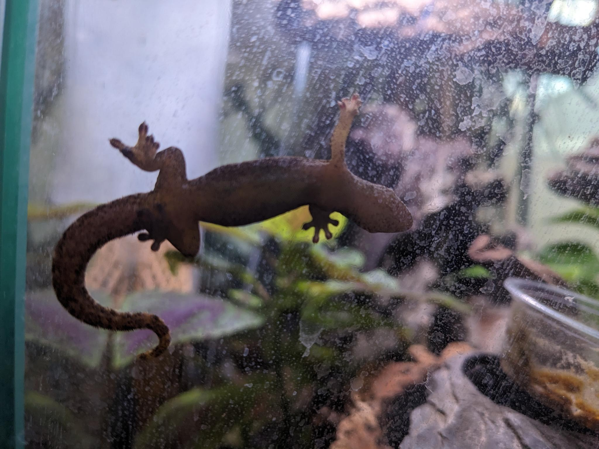
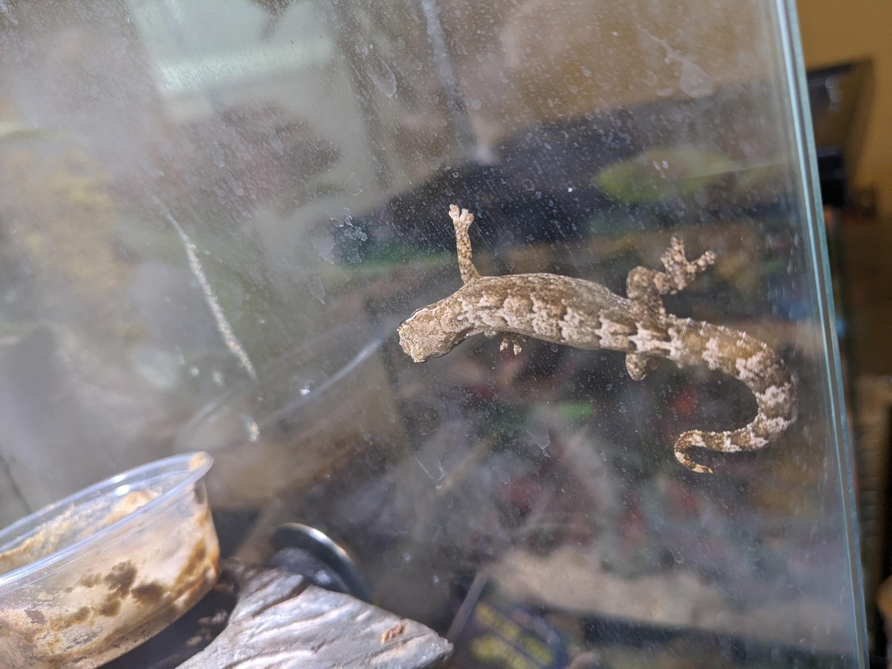
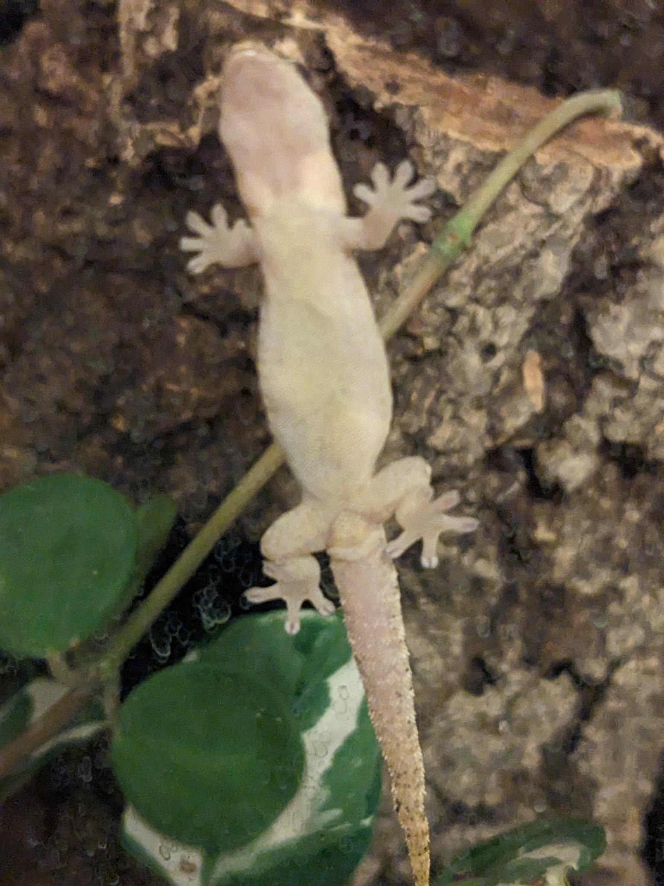
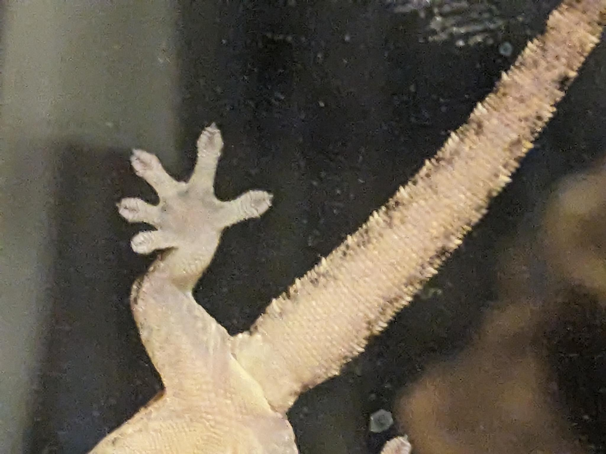
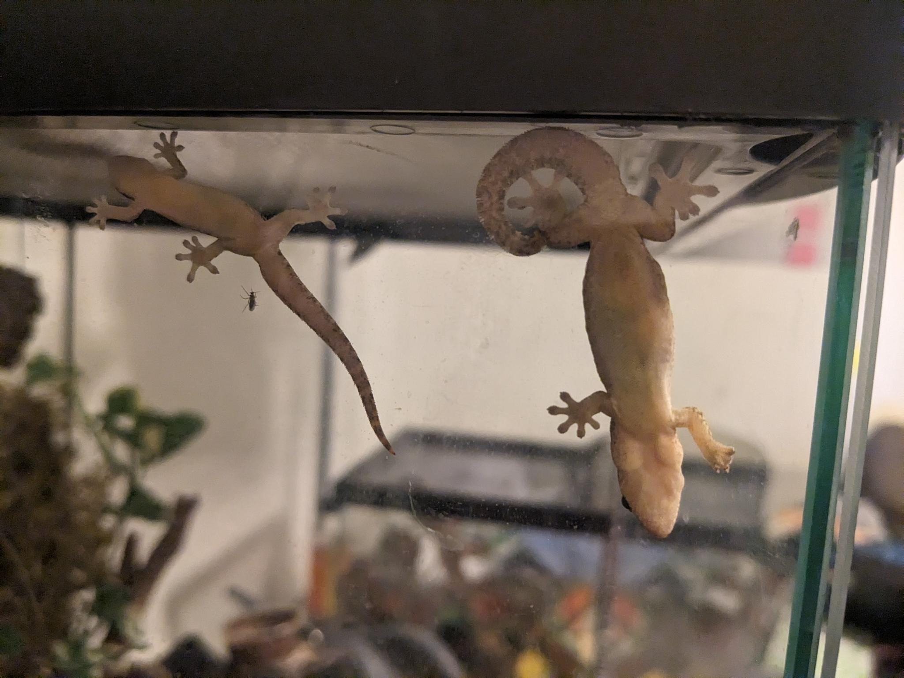
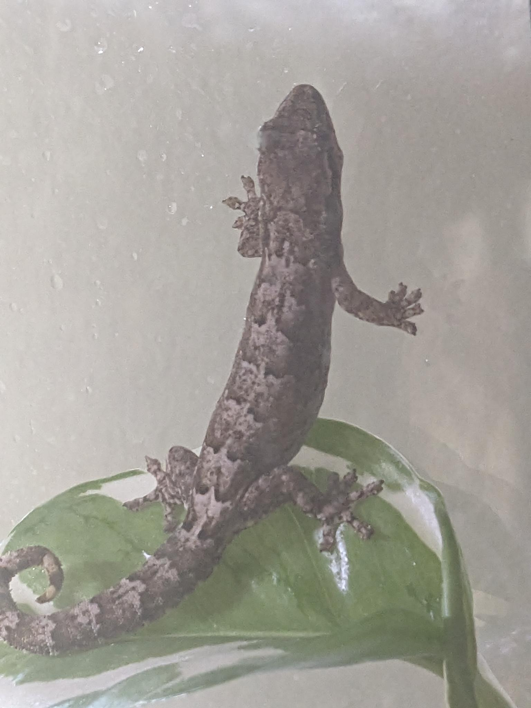
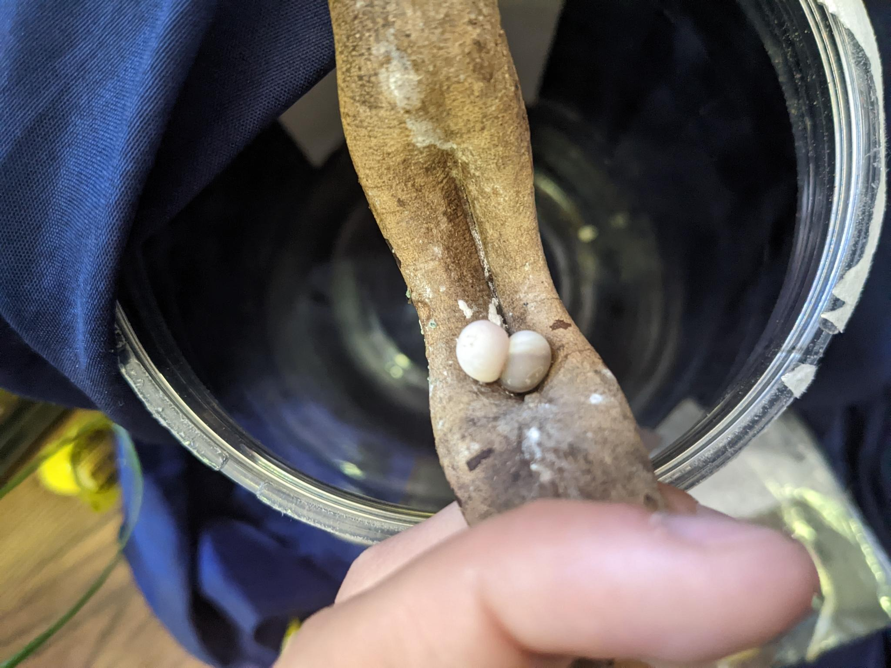
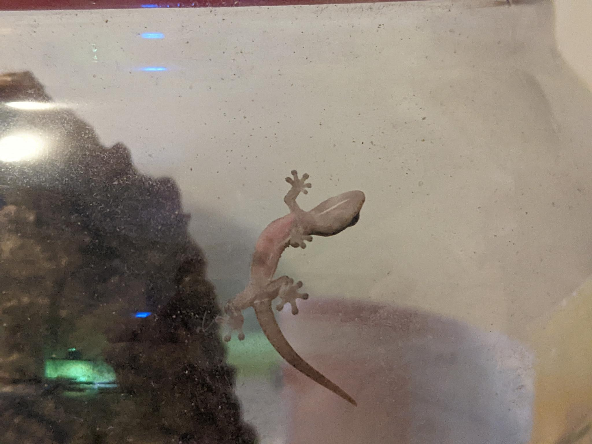
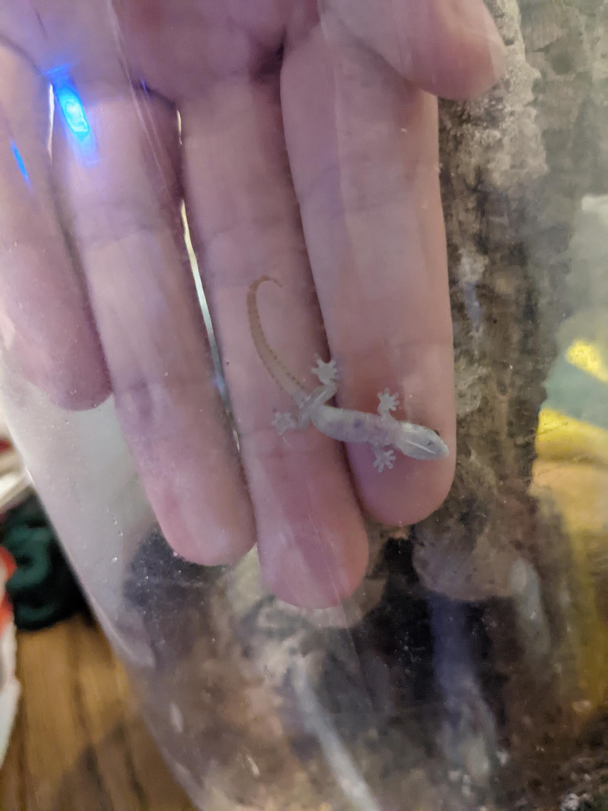
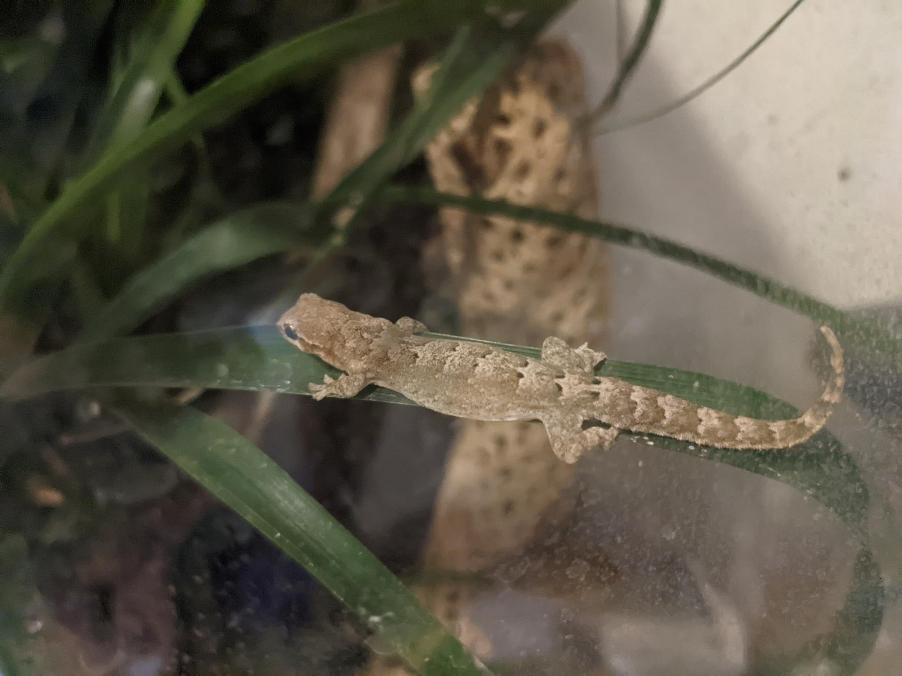
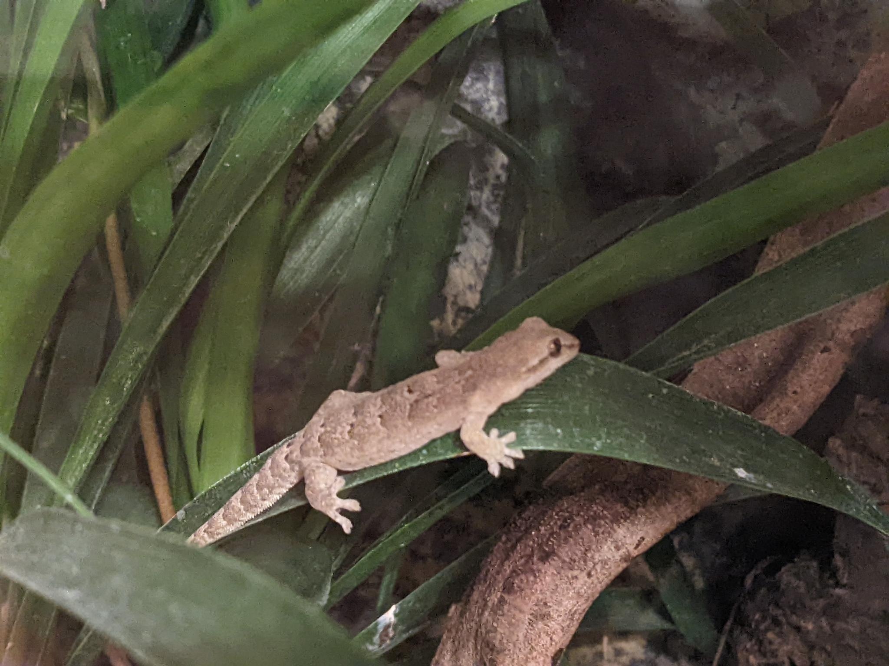
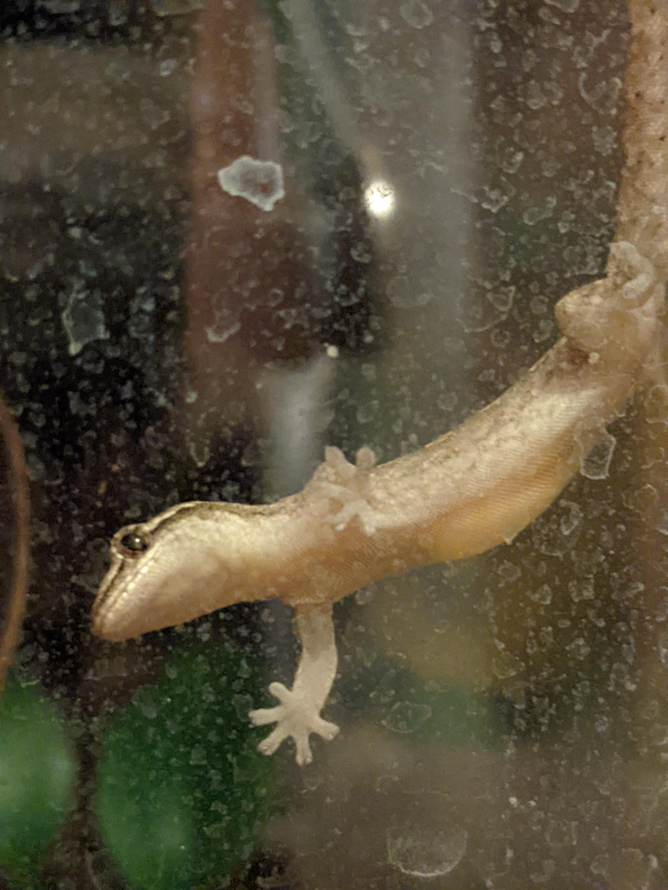
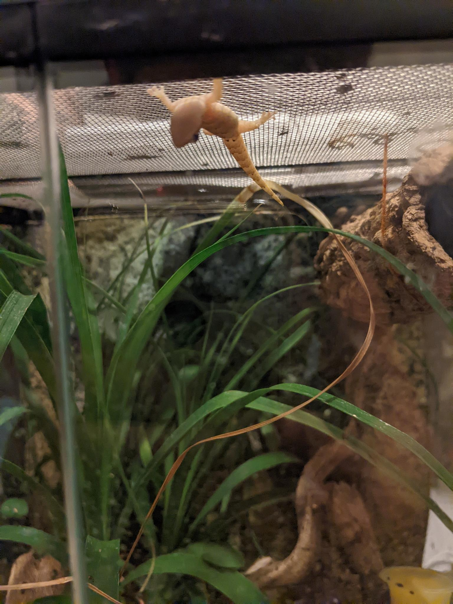

