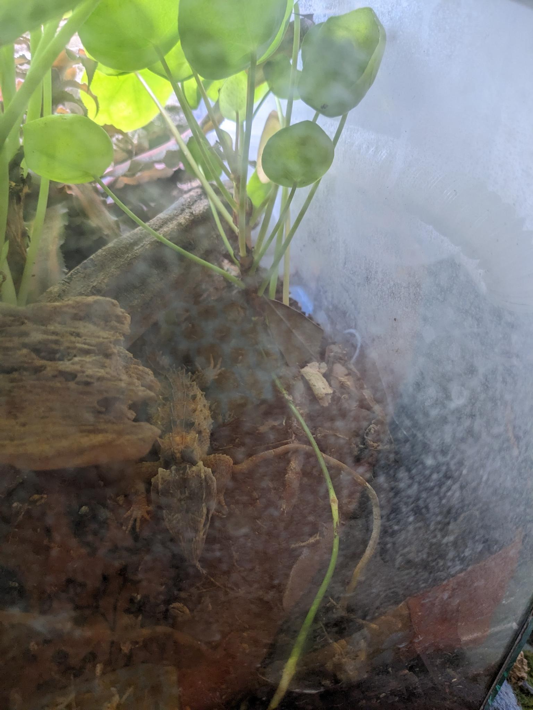
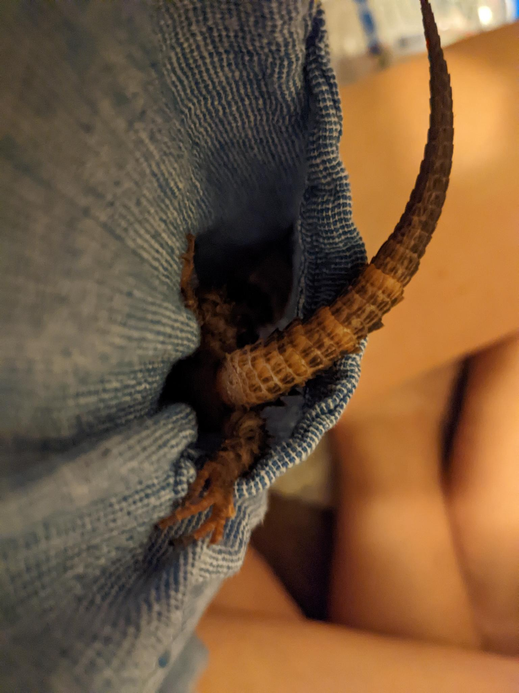
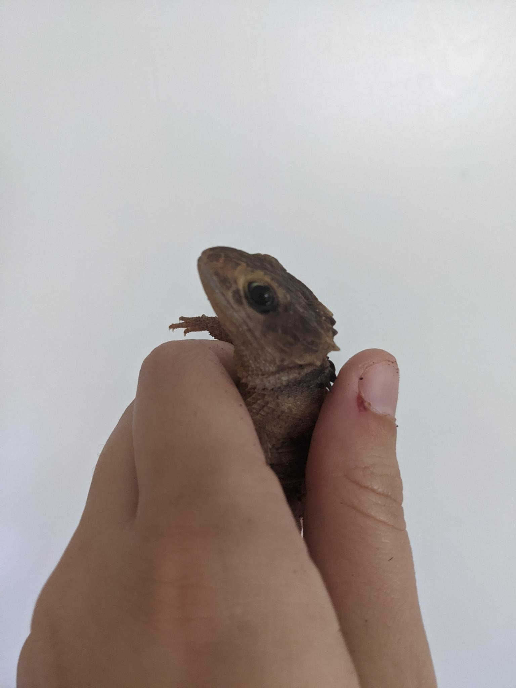

# St. George

St. George is a white-eyed crocodile skink.  He has been coming out of his spooked self very slowly.  I generally handle him only for wellness checks, as these reptiles are known to be aloof and St. George seems to be especially spooked when handled.  Crocodile skinks will sometimes play dead when they are spooked.  Since St. George is particularly susceptible to being scared, he plays dead fairly often.  You can see this reflected in some of the pictures.

